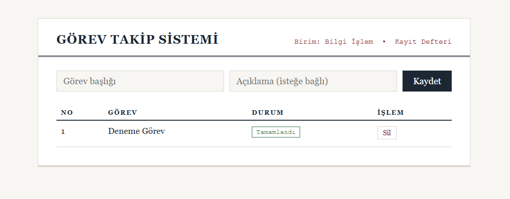

# Görev Takip Sistemi

Spring Boot ile geliştirilmiş, katmanlı mimaride bir görev yönetimi uygulaması. JSON tabanlı bir REST API ve bu API'yi tüketen jQuery tabanlı hafif bir web arayüzü içerir.

## Özellikler

Görev oluşturma, listeleme, güncelleme ve silme; Bekliyor, Devam Ediyor ve Tamamlandı adımlarından oluşan durum yönetimi; durum bazlı filtreleme; Bean Validation ile girdi doğrulama; merkezi hata yönetimi ve doğru HTTP durum kodları (200, 201, 204, 400, 404).

## Teknolojiler

Java 17, Spring Boot 3, Spring Data JPA (Hibernate), H2 / MSSQL, Maven, JUnit 5, Mockito, MockMvc, jQuery.

## Çalıştırma

JDK 17 ve Maven 3.8 veya üzeri gereklidir. Proje kök dizininde "mvn spring-boot:run" komutu uygulamayı başlatır; uygulama yerel makinede 8080 portunda açılır. Geliştirme ortamında gömülü H2 veritabanı kullanılır. MSSQL Server'a geçiş, application.properties dosyasındaki hazır profil sayesinde yalnızca konfigürasyon değişikliğidir. Testler "mvn test" komutu ile çalıştırılır.

## REST API

Tüm uç noktalar /api/gorevler altında toplanır. GET ile görevler listelenir (durum parametresi ile filtrelenebilir) veya id ile tek görev getirilir. POST yeni görev oluşturur, PUT mevcut görevi günceller, PATCH ile görevin durumu değiştirilir, DELETE görevi siler.

## Mimari

Proje dört ana katmandan oluşur: controller paketi sunum katmanını (REST), service paketi arayüz ve gerçekleştirimden oluşan iş katmanını, repository paketi Spring Data JPA tabanlı veri erişim katmanını, entity paketi ise JPA varlıklarını barındırır. Entity'ler dış dünyaya dto paketindeki veri taşıma nesneleri üzerinden açılır; hatalar exception paketindeki merkezi hata yöneticisinde toplanır. Katmanlar arası bağımlılıklar constructor injection ile yönetilir. Servis katmanı Mockito ile birim testlerine, web katmanı MockMvc ile katman testlerine sahiptir.

## CI/CD

Depodaki Jenkinsfile, derleme, test ve paketleme aşamalarından oluşan örnek bir Jenkins boru hattı tanımlar.
